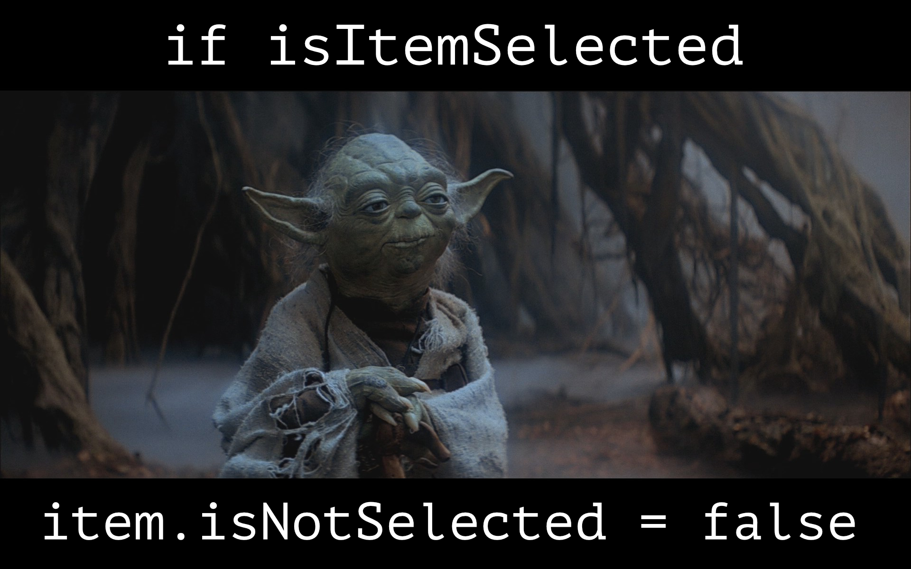

+++
title = "Writing code for humans"
description = "Tried and tested naming conventions that will increase code readability and raise your dev team's performance."
date = 2020-03-30T08:55:00Z

# The weight as defined on the Section page of the documentation.
# If the section variable `sort_by` is set to `weight`, then any page that lacks a `weight`
# will not be rendered.
weight = 0

# A draft page is only loaded if the `--drafts` flag is passed to `zola build`, `zola serve` or `zola check`.
draft = false

# Use aliases if you are moving content but want to redirect previous URLs to the
# current one. This takes an array of paths, not URLs.
aliases = []

# When set to "true", the page will be in the search index. This is only used if
# `build_search_index` is set to "true" in the Zola configuration and the parent section
# hasn't set `in_search_index` to "false" in its front matter.
in_search_index = true

# Template to use to render this page.
template = "page.html"

# The taxonomies for this page. The keys need to be the same as the taxonomy
# names configured in `config.toml` and the values are an array of String objects. For example,
# tags = ["rust", "web"].
[taxonomies]
categories = ["programming"]
tags = ["dx"]

# Your own data.
[extra]
image = "yoda-coda.jpg"
+++



Working in a team environment requires effective communication. It's the reason why in a team we all work on the same project, in the same office, and speak the same language.

We need to have common vernacular to be able to communicate effectively with others. Writing code the same way that we speak will improve how our code is communicated and understood.

Do you ever completely lose your mind whilst reading someone else's code?
Maybe you go bananas over code you wrote last week?

In this article, I have outlined some tried and tested naming conventions that will increase code readability and raise your dev team's performance.

All examples are written in pseudoscript. You can apply them to any language.

> "Programming is the art of telling another human what one wants the computer to do."<br />- Donald Knuth

## Write for clarity

Consider the variable `openModal`. When coming across it in the code, a developer can easily assume that `openModal` is a function, with the purpose to **open a modal**. Storing the modal's identifier in this variable would be confusing. Call it a more accurate name, like `currentModalId` instead.

If you thought `openModal` was the correct name for a boolean, guess again; `modalIsOpen` is much more explicit.

We can use the English language itself to help us name our variables!
**if modal is open** sounds way more natural than **if open modal** or **if is modal open**. I am sure that our little green Jedi would be impressed. However, your fellow humans would prefer you to communicate your intention more clearly.

Here I have provided examples of things that don't require much guesswork or assumption. The basis for all of these examples is to _write your code so that it reads how you would speak_. If possible, follow the approach of naming your functions and variables so that when taken out of context, a fellow developer will understand its purpose.

You shouldn't have to read through multiple lines of code and memorize several other variables to understand what a specific variable is for.

Sure, in many languages you can jump to the declaration, or hover over the variable to find its type. Regardless, you shouldn't have to do this. Treat your code as a product, and create a nice experience for the users (fellow developers) of your code.

If we have the power to name things whatever we want, why not name things with purpose and precision?

**Tip**<br />
_When naming variables, sometimes it can help to speak the name out loud in the context of other code._

Okay, let's name our variables clearly for humans to read!


Photo by [Daniele Levis Pelusi](https://unsplash.com/@yogidan2012)

## Naming Conventions

## Functions

When you write a function, you are literally talking to a computer. Either you are telling the computer to do something **a command**, or you are asking the computer **a question**. So when writing your functions, name them so that our fellow humans can understand the intention and meaning behind the function. Name them as a command or a question!

For example, let's say we want to know the total price of all items in a shopping cart.

`var totalPrice = getTotalPrice(cartItems)`

How about checking to see if all cartItems are in stock?

`var allCartItemsAreInStock = areAllCartItemsInStock()`

### Do it now!

There is an important difference between something's state right **now** vs where it **should** be. This can be difficult for devs coming from a non-english speaking background. When something **should** have a specific state, we are expressing that there is a set of rules that enforce this state, otherwise we are describing the state **now** without any conditions.

### What is that? Do this!

Here are three functions:

```ts
disableButton(buttonId);

isButtonDisabled(buttonId);

shouldButtonBeDisabled(buttonId);
```

Please take a moment and think about what each of the functions is for. How do you think it would be used without having prior knowledge of its context?

Each of these functions means something very specific, just by reading the name a developer should know exactly what the expected output and behaviour is.

Disabling a button when a condition is met.

```ts
/*
* @param {string} buttonId
*/
function disableButton(buttonId) {
    // disables the button
}

// implementation
if(/* condition */) {
    disableButton(buttonId)
}
```

Checking if a button is disabled.

```ts
/*
 * @param {string} buttonId
 * @returns {boolean}
 */
function isButtonDisabled(buttonId) {
  // returns true/false based on the buttons state
}

// implementation
var buttonIsDisabled = isButtonDisabled(buttonId);
```

Should a button be disabled for a specific condition?

```ts
/*
 * @param {string} buttonId
 * @returns {boolean}
 */
function shouldButtonBeDisabled(buttonId) {
  // returns true/false based on rules/conditions
}

// implementation
var buttonShouldBeDisabled = shouldButtonBeDisabled(buttonId);
```

### Step into the light

`var isItemSelected = isItemSelected()` - don't write a variable using the same name as the function it is returned from.

`var itemIsSelected = isItemSelected()` - swapping the words around can actually solve two problems:

- the variable name is now different to the function name.
- the variable is now more easily understood when written in conditional expressions, e.g. `if(itemIsSelected)` vs `if(isItemSelected)` 👽

I recommend using [eslint](https://eslint.org) and the [no-shadow rule](https://eslint.org/docs/rules/no-shadow) to highlight areas where the same variable name is used multiple times within the same file.

### Ask questions

When writing a boolean variable you are declaring state.
When writing a function that returns a boolean you are asking a question.

`getIsChecked(itemId)` - this is okay, but the function can be named something better. It's also good to be specific, what exactly is checked?

`isItemChecked(itemId)` - asking a question is a great way to describe what you'd like from the computer. This is how I recommend you to write functions that return booleans.

`item.isChecked()` - this is fine, however I personally like to work using simple objects and pure functions rather than objects with methods that report on states or properties of that object.

> "Any fool can write code that a computer can understand. Good programmers write code that humans can understand."<br />- Martin Fowler

## Booleans

Interestingly we seem to have the most trouble with booleans, even though they only can have two possible values (excluding null).

When writing a boolean, you are describing the state of something, the thing that you are describing could be: disabled, active, loading, completed, hidden, etc. These are the states that your object may have.

Using grammatically correct English, an object can't be _hide_. However an object can be _hidden_! An object can't _parts_. However an object can _have parts_!

A boolean is not an array or a function.

Here are some conventions you can follow for naming booleans.

### Properties on objects

Below you'll see that boolean properties can be questions, but only when they're attached to objects. If you're extracting the boolean out into a variable then you must rewrite the boolean as a declaration of state.

`component.tabs` - the assumption here without context is that `tabs` is an array of `tab` as it is plural. What if you meant for it to be a boolean?

`component.hasTabs` - adding **has** solves the problem, the component **has** tabs, it now obviously describes a boolean.

`component.disable` - the assumption here without context is that `disable` is a function that you can call to disable the component.

`component.disabled` - by changing the word `disable` to `disabled` it is has become a past tense verb. It is now a state that the item can have, in this case the component is disabled.

`item.hidden` - some words like `hidden` can be used without placing `is | has | with` at the start, these words can't be misinterpreted to mean something else.

`item.open` - other words like `open` have double meanings and so we should be careful. The word open can describe state or a command, e.g. “a door is _open_”, “please _open_ the door”. So it's best to use either a different word, or append "_is_" to the variable name.

`item.isHidden` - it might be preferred to keep a codebase consistent by always using linking words for object properties. If a property is pulled out into a variable then you can write it without the dot,

e.g. `var itemIsHidden = item.IsHidden`

How cool is that!

**Side note**
`component.enabled` - if most use cases are enabled, then it is more effective to use `component.disabled` and set it to `false` by default. Setting booleans `false` by default is a nice way to keep consistency and simplicity in the code base.

### Variables

Boolean variables describe the state of _something_. That _something_ must be included in the name.

`var isCartLoading = true` - this sounds like a question, and a function returns an answer, so this would be suitable as a function name instead of a boolean.

`var cartIsLoading = true` - this is more straightforward and reads like how we would describe the state to a fellow human being.

### Write it like you mean it

Here is a function that returns true if all items are selected.

`var selected = getAllItemsAreSelected()` - the variable `selected` could be misunderstood further down in the code, `selected` doesn’t describe any context, it could be the state of something `component.selected`. From reading the function name, we can assume that it returns an array and not a boolean.

`var areAllItemsSelected` - this sounds like a question, a suitable name for a function.

`var allItemsAreSelected` - this is a suitable name for your boolean variable, now the intention is clear.

`var allItemsAreSelected = areAllItemsSelected()` - here we've renamed the function as well, describing it as a question instead of a command. It is much more intuitive, this is how we’d talk to a fellow human.

`if(areAllItemsSelected)` - written as a question, this doesn't read how we communicate.

`if(allItemsAreSelected)` - this is the correct way to name the variable, by declaring boolean state, it reads much more naturally and the intention is clear.

`if(areAllItemsSelected())` - keep in mind that this is also correct. Sometimes we may want to call a function directly as the condition. Here I recommend to continue to stick to the convention, a function is a command or a question, not a boolean.

### Double negatives

`item.isNotVisible` - never write a negation in the name of a variable. It can be especially confusing to understand when combined with other booleans and functions in an expression. This a common recommendation, but considering how often I see this beasty I thought I’d also include it.

## Numbers

### Magic numbers

Avoid the use of numbers directly in the code unless it is completely obvious to the reader of your code what the number is for.

```ts
generateFooBarDevice(30, 50);

// vs

var power = 30;
var mass = 50;
generateFooBarDevice(power, mass);
```

### Variables

`var bananas = 5` - the assumption here is that `bananas` describes a collection of `banana`, an array, not a scalar quantity.

`var numberOfBananas = 5` - this name is much more descriptive of your intention.

## Conclusion

I'm sure that many of you have come across code you've had to reread several times to comprehend. Poorly chosen names for variables and functions play a significant role in the confusion; the logic is often quite simple.

Thanks for coming along with me on this journey. I believe that as developers, it is our responsibility, our duty, to share, teach, learn, simplify and improve our communication with others through code. I have learnt much from writing this article. I hope that it has also opened your mind to new possibilities and opportunities. Happy coding!
